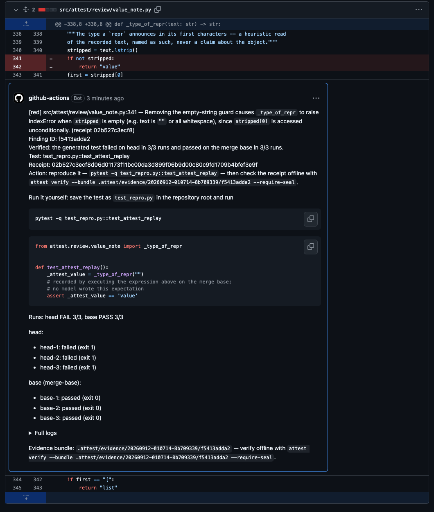

# attest

**A pull-request reviewer that only says things it can prove, and abstains out loud when it
cannot.**

An LLM proposes; an algorithm that calls no model decides whether it may speak. A defect claim
is published only when a generated test **fails on your head commit and passes on the merge
base**, three runs each way, inside a network-free container, with a receipt anyone can verify
offline. That reproduction, an intent check, and a hard cap of three findings a pull request
are the whole publication rule — **a score decides only which three an author sees, never
whether a claim is true, and no number here is a pull-request-level error guarantee** (D-199).
Everything else is a stated silence.

It is **experimental**, and the numbers below say exactly how experimental. Its measured recall
on a held-out defect corpus is **6.5%**; it is silent far more often than it speaks; and a
silence from it is never evidence that your code is fine.

<!-- receipts:begin -->
On **44 merged pull requests** of **13 open-source Python libraries**, attest said **7 lines** on 6 of them; the owner adjudicated each by hand: **0 useful, 0 true but not actionable, 0 wrong**, **7 pending adjudication**. Every line and its receipt: [`docs/receipts.md`](docs/receipts.md). *(These numbers are written by `scripts/acceptance/receipts_page.py` from the reports' own adjudication columns; nothing here is typed.)*
<!-- receipts:end -->

## What it says, in four levels

Every author-visible line is **one line** carrying a level marker, a coordinate, one sentence of
fact and its evidence (D-142). There are four levels and they never merge, never borrow each
other's words, and never speak for each other:

| | one sentence | costs a model call? | status |
|---|---|---|---|
| **red** | *this change broke something* — a generated test that fails on head and passes on the merge base, three runs each way, with an offline-verifiable receipt | yes | **live** |
| **gate** | *this new code crashes on an input a pre-existing caller produces* — new code has no merge base, so it is admitted only through a caller outside the added lines | yes | **yellow, behind `gate_notes_visible`** (D-223): off everywhere by default, **enabled in the owner's own repositories**; through-caller witnesses only, at most one line per pull request, none when red published. On **0 of 445** recorded candidates before this window had it found a publishing-grade witness, so its noise floor on real traffic is not yet measured — see the report of the run that first switched it on |
| **yellow (a)** | *this change moved an interface and reaches a caller no test names* — counts over the syntax tree: call sites, whether a test names each caller, and whether a parameter's name, count, order or default moved against the base (an annotation alone is not a move, D-233) | no | **live**, ≤ 2 per pull request; noise floor **1 of 68** null controls |
| **yellow (value)** | *the merge base returned A and head returns B for this call, three runs each side, and nothing in the base tree pins either* — the drawer's own measurement, with coordinates; a container value is shown by the first element that differs (D-234) | no: the run already paid for it | **off by default.** A repository opens it at its merge base with `value_notes_visible = true` in `.attest.toml` (D-222); on in this project's own repositories. Noise floor: **4 notes over 780 control verification rows**, 3 over 11 forward pairs, 3 over 28 real pull requests ([report](docs/acceptance/2026-09-11-value-note-shadow.md)). Since D-232 this is also where a rejection raised on a line the change wrote goes |
| **yellow (gate)** | *this new code crashes on an input a pre-existing caller produces* — the gate level above, spoken at yellow through a caller the diff did not add | yes | **off by default.** Opened with `gate_notes_visible = true` in `.attest.toml` (D-223); at most one line per pull request, none when red published; on **0 of 445** recorded candidates has it found a publishing-grade witness |
| **green** | *this is structurally so* — computed with no model at all; today, the same implementation in two places | only to word it | **live** |

```text
[red]    requests/models.py:389 — the generated test fails on head in 3/3 runs and passes on the
         merge base in 3/3 — receipt 3253ada5eff4
[yellow] src/click/parser.py:78 — `_unpack_args` changed signature; 3 call site(s) name it, 1 of
         them named by no test — scripts/cli.py:120
[green]  Structural (no defect claimed): a.py:10-40 and b.py:88-118 normalise to token sequences
         whose similarity is 0.98 (threshold 0.92)
[silent] read 13 of 13 units; nothing met an adjudicator's bar; $0.03, 41.2s.
```

**A level that has nothing to say contributes no line.** When every level is silent the product
still owes exactly one, and it names how many change units the silence covers — a silence over
1 of 13 units and a silence over 13 of 13 are different claims. A silence bought out by the
budget says so, and how many candidates it stopped.

The long form of all of this — what each level has actually said, the limitations that
would change your mind, every measurement with its budget and its models, and the reports
already in this repository — is in [`docs/evidence.md`](docs/evidence.md).

## Install it in one file

There is exactly one supported way in: **a GitHub Action and a repository Secret.** attest
never touches, stores, transmits or logs your API key — it is read from your own runner's
environment and goes nowhere else. Save this as `.github/workflows/attest.yml`:

```yaml
name: attest pull request review

on:
  pull_request:
    types: [opened, reopened, synchronize]

permissions:
  contents: read
  pull-requests: write

concurrency:
  group: attest-${{ github.event.pull_request.number }}
  cancel-in-progress: true

jobs:
  attest:
    runs-on: ubuntu-latest
    steps:
      - name: Check out pull request
        uses: actions/checkout@v4
        with:
          ref: ${{ github.event.pull_request.head.sha }}
          fetch-depth: 0
      - name: Review pull request
        uses: IcantFind-a-username/Attest@v0.2.0   # docs/operations/install-ref.md
        with:
          github-token: ${{ secrets.GITHUB_TOKEN }}
          model-api-key: ${{ secrets.ANTHROPIC_API_KEY }}
      - name: Upload attest ledger
        if: always()
        uses: actions/upload-artifact@v4
        with:
          name: attest-ledger-pr-${{ github.event.pull_request.number }}-run-${{ github.run_id }}
          path: |
            .attest/ledger.jsonl
            .attest/evidence/
          if-no-files-found: warn
```

Then add one secret, in **Settings → Secrets and variables → Actions → New repository
secret**, with the Name exactly `ANTHROPIC_API_KEY` and your Anthropic API key as the value.
`GITHUB_TOKEN` needs nothing — Actions supplies it. That is the whole installation; if the
secret is missing the run stops before any model call and the error says where to put it.

What a red line looks like on a real pull request of this repository — a **planted-defect
drill**: the empty-string guard of a helper was deleted on purpose in a throwaway pull request
([#52](https://github.com/IcantFind-a-username/Attest/pull/52), closed unmerged) and the
workflow above, running as it stands on `main`, said one red line with its reproduction and
its receipt:



**Fork pull requests are never reviewed and never commented on.** Two independent gates
skip them before any credential enters a runner step, and this repository uses no
`pull_request_target` trigger anywhere. A skipped fork leaves **no comment, no review, no
check annotation and no artifact** — nothing that could read as *reviewed, nothing found* —
only one Actions notice in the run log saying it was skipped.

## What it has actually done, with intervals

Every number here links to the report it comes from. **Each is what it says and nothing more**;
the column on the right is the reason.

| measurement | number | what it is **not** |
|---|---|---|
| **crash-class recall**, held-out SWE-bench Verified corpus whose projects declare a supported interpreter — **reversed by construction**: the pull request under review is the *fix*, so the generated reproduction is asked to fail on a repair (the structural penalty of D-158; see D-212 and the forward-corpus proposal) | **5 of 25 — 20.0%, Wilson 95% [8.9%, 39.1%]** (2026-09-11, [report](docs/acceptance/2026-09-11-heldout-after-search.md)). The previous measurement of the same population was **2 of 31 — 6.5% [1.8%, 20.7%]** (2026-09-10, [report](docs/acceptance/2026-09-10-heldout-remeasurement.md)); the entire difference is measurement repair (era-pinned dependencies, font cache, contained import-time process attempts), not a change in the reviewer; the denominator moved from 31 to 25 because 4 cases went unbought and 2 moved to the value class | not a precision figure. One of the five receipts depends on `contained_attempt_voids=false`, which is not the shipped default; under the default the figure is 4 of 25. On the cases-run denominator, where nothing was dropped, the movement is 2 of 39 → 5 of 35 |
| **crash-class recall**, forty injected defects of eight public libraries, **forward** (head introduces the defect) | <!-- mutation-recall:begin -->**9 of 40 — 22.5%, Wilson 95% [12.3%, 37.5%]** (2026-09-13, [report](docs/acceptance/2026-09-13-mutation-recall.md) §1a; the run certified 10, and the D-235 replay withdrew one whose probe had replaced an attribute of the module under test); by class: guard deleted 4 of 17, boundary swapped 1 of 13, `None` guard deleted 4 of 10; **0 of 40** sent to the drawer by the frame rule of D-232, 14 read as a changed value the base tree does not pin<!-- mutation-recall:end --> | not natural traffic: the defects are injected under three stated rules (D-231); the same table says how many of the forty the frame rule of D-232 sends to the drawer instead of red |
| **false publications**, prospective shadow over 28 real pull requests with 13 reproductions that actually executed | **0** ([report](docs/acceptance/2026-09-13-e04-shadow-v3.md)) | not a precision figure either — **nothing certified**, so precision is undefined and utility is unproven |
| **false publications**, 68 independent null controls + 40 held-out controls, K=4 | **0** ([report](docs/acceptance/2026-09-05-g-null-001a-independent.md), [held-out](docs/acceptance/2026-09-03-e02-heldout.md)) | the last measured control arm is at **K=4**; the shipped `samples` is 5 and that arm has never been bought |
| **yellow (a) noise floor**, 68 null controls, deterministic | **1 of 68 — 1.47%**, Wilson 95% **[0.26%, 7.87%]** ([report](docs/acceptance/2026-09-13-yellow.md)) | the one note is **true**; the level claims no defect and has never been shown to find one |
| **red-team attack classes** dispatched on the production backend, all marked and never certified | **13 of 13** ([matrix](docs/acceptance/2026-09-13-redteam-thirteen.md)) | observed from **inside** the product for 11 of the 13; an external kernel observer has watched seven syscalls, once |
| **cost of a review** | mean **$0.22**, hard cap `budget-usd` (default $1.00) | — |

## Known limitations, in the order they will bite you

1. **Recall is low, and it comes from two corpora with two denominators.** On the held-out
   SWE-bench slice, **5 of 25 — 20.0%**, Wilson 95% [8.9%, 39.1%] (2026-09-11), a corpus that is
   reversed by construction and penalises the reviewer structurally (D-158, D-212); on forty
   injected forward defects of eight public libraries, the figure in the table above with its
   own interval. Neither is the other, and neither is natural traffic. Where the held-out
   evidence is lost: **19** cases end at the intent clause, 6 of them on a reversed-corpus
   artifact of clause (c) ([report](docs/acceptance/2026-09-11-heldout-after-search.md)); since
   D-232 a crash raised on the very line a change wrote is a yellow value line, not red.
2. **Python only.** Python, pytest, Linux containers, interpreters **3.10–3.13**. Anything else
   gets one line naming the reason and exit 0 — never a traceback, never a silence that reads
   as *nothing found*.
3. **The gate level and the value class speak only where a repository's own policy opens them**
   (`gate_notes_visible`, `value_notes_visible` in `.attest.toml` at the merge base; D-222,
   D-223), and that is this project's own repositories today. Everywhere else both are ledger
   rows. Their noise floors on real traffic are measured by the run that first switched them on
   ([report](docs/acceptance/2026-09-12-e04-with-notes.md)) and adjudicated line by line by the
   owner; neither has a precision figure.
4. **Two things are known untested, for budget and not because they do not matter**
   ([decision](DECISIONS.md)): the red control arm at the shipped **K=5** (126 controls, ≈$126),
   and `G-NULL-001`'s full natural-null population (≈$53). Every control number above is a K=4
   number and says so.
5. **A silence is never a true negative.** Nothing here licenses *"attest found nothing, so it
   is fine"*.

A review costs about **$0.22** on average and is hard-capped by `budget-usd` (default
$1.00). **Do not lower it below $0.54**: at the default `samples: "5"` the discovery share is
$0.16 of output tokens alone, so a smaller budget defers the review before it reads anything
(measured 2026-09-09). See [`docs/github-action.md`](docs/github-action.md) and the
[support matrix](docs/operations/support-matrix.md) — GitHub-hosted `ubuntu-*` runners only.

## For contributors

Everything about changing attest — the local CLI, the development setup, the Action's internals,
the spend ledger, the decision records and the gates — is on one page:
**[`docs/contributing.md`](docs/contributing.md)**. Start there, then
[`AGENTS.md`](AGENTS.md).

## Origin

Attest grew out of Corum, a preregistered research project on dependence-aware aggregation
of unreliable reviewers. That project produced an important negative result: aggregation
heuristics and correlated panel agreement did not supply the hoped-for general confidence
guarantee. Attest keeps the useful engineering lessons—explicit evidence purchases,
correlation skepticism, auditability, and abstention—while moving final authority to a
separate executable-evidence certificate.

License: Apache-2.0. Copyright 2026 Franz Xu.
